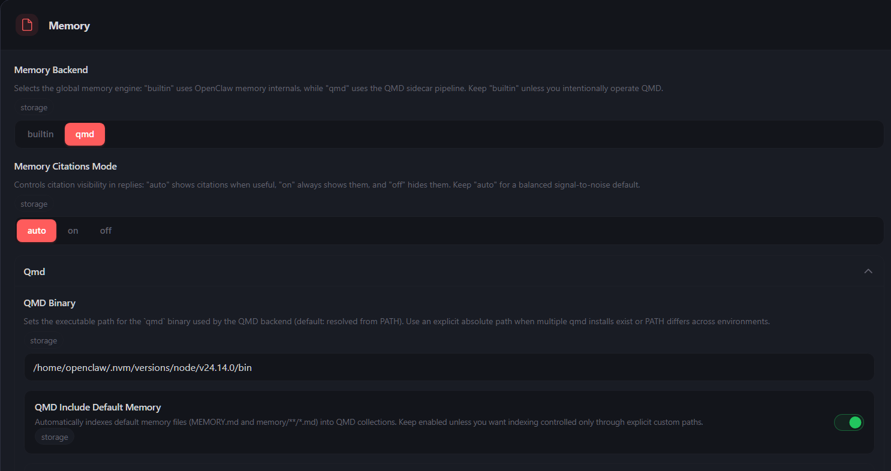
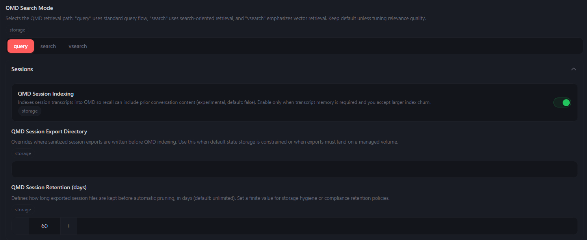
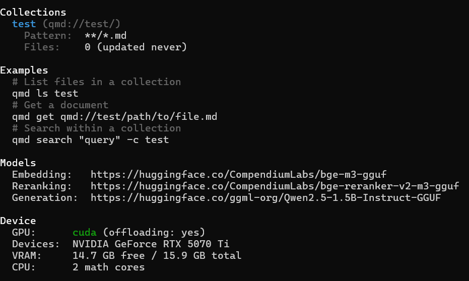
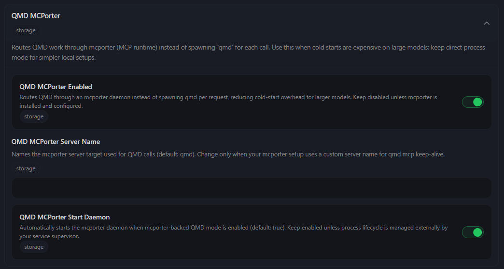

# 🐉 QMD-Chinese (QMD 中文语义版)

QMD-Chinese 是专为中文语境深度改造的本地 RAG (检索增强生成) 命令行检索引擎。本分支在原版的基础上，彻底重写了中文分词与分块逻辑，并全面替换了最顶尖的中文开源大模型，旨在为 OpenClaw 等 AI 代理提供最极致的本地中文私有知识库支持。

## 👏 特别鸣谢 (Credits)

本项目基于卓越的开源项目 **[QMD (https://github.com/tobi/qmd)]** 进行本地化改造。
核心的 RRF (倒数秩融合) 排序算法、CLI 架构及底层的向量混合检索逻辑均归功于原作者的出色工作。本分支仅针对中文 NLP 场景与模型依赖进行了深度重构与优化。向原作者致以最诚挚的感谢！

## 🚀 核心特性与模型组合

摒弃了原版对英文主导模型的依赖，本分支使用了当前地表最强的本地中文处理流水线：

* **Query Expansion (查询前置扩写):** `Qwen2.5-1.5B-Instruct` (极大提升中文口语化提问的命中率)
* **Embedding (向量嵌入):** `BGE-M3` (智源顶配多语言向量模型，支持超长上下文)
* **Reranking (重排模型):** `bge-reranker-v2-m3` (精准的二次语义排序)
* **优化中文语义理解:** 

## 💻 硬件与运行环境建议

⚠️ **【强烈警告】：非常不建议在常规 VPS (如 1核1G / 2核4G 的云服务器) 上运行本项目。** 多模型并发推理会瞬间耗尽 VPS 的内存并导致进程被系统 OOM 杀掉。

**推荐运行环境：**
* **本地 PC 工作站** (Windows WSL2 或 原生 Linux)
* **独立显卡：** 强烈推荐配备 **NVIDIA 独立显卡** (如 RTX 30系 / 40系 / 50系)。本项目底层依赖 `node-llama-cpp`，配置正确的 CUDA 加速后，检索与推理速度将有数十倍的提升。
* **网络需求：** 必须具备外网访问能力以联网下载模型。请注意，**普通的 proxy 环境变量对 Node.js 原生的 fetch 无效**。在国内网络环境下，可以通过设置 Hugging Face 国内镜像来顺利下载模型。

## 🚀 模型下载与环境配置 (国内环境指南)

**1. 设置镜像环境变量**
在终端中执行以下命令（建议将其加入到 `~/.bashrc` 或 `~/.zshrc` 等配置文件中使其永久生效）：
```bash
export HF_ENDPOINT=https://hf-mirror.com
```

**2. 触发模型自动下载**
配置好镜像后，可以通过运行基础命令来触发依赖模型的自动下载：
- 触发下载**向量模型 (Embedding)**：
  ```bash
  qmd embed
  ```
- 触发下载**生成扩写模型 (Query Expansion)**与**重排模型 (Rerank)**：
  ```bash
  qmd query --rerank "测试查询"
  ```

**3. 检查下载状态**
在终端执行上述命令并等待下载完成后，你可以前往缓存目录检查。正常情况下，该目录下应当包含 3 个已经下载完毕的模型文件：
```bash
ls ~/.cache/qmd/models
```

## 📦 安装指南

由于包含原生编译模块，请确保你的系统已安装 `Node.js` (推荐 v20+) 以及 `git`。

执行以下命令全局安装：
# npm install -g @gmvp3/qmd-chinese

⚙️ OpenClaw 集成与配置
将 QMD-Chinese 作为 OpenClaw 的本地记忆后端，请在 OpenClaw 的 Settings -> Memory 中参考以下截图进行精确配置：

1. 基础挂载设置

Memory Backend: 必须选择 qmd。

QMD Binary: 你在命令行输入qmd有效的话，默认为空就行

Include Default Memory: 开启 (绿色)。



2. 检索模式与记忆留存
QMD Search Mode: 必须选择 query (此模式才会触发 Qwen2.5 扩写流水线)。

QMD Session Indexing: 开启 (绿色)，允许索引日常对话。

QMD Session Retention (days): 强烈建议设置为 30 或 60 天，定期清理无用废话，保持向量数据库的信噪比。



🛠️ CUDA 硬件加速状态验证与排错
安装完成后，在终端运行以下命令检查运行状态：
qmd status

✅ 成功的状态：
如果你看到 Device 区域显示 GPU: cuda (offloading: yes) 并且正确识别了你的显卡型号（如下图的 RTX 5070 Ti），说明 CUDA 加速已完美开启！



❌ 失败的排错指南：
如果显示使用的是 CPU 或者提示缺少 CUDA，请检查以下几点：

Cmake 是否缺失： 底层的原生模块需要编译环境。请在终端执行 sudo apt-get install cmake build-essential (Ubuntu/Debian) 来安装必备工具。

驱动与 Toolkit： 确保 WSL2 或 Linux 系统内已正确安装 NVIDIA 驱动及 CUDA Toolkit。

耐心等待编译： 第一次 npm install 时，底层的 llama.cpp 需要根据你的显卡架构实时编译 CUDA 驱动代码，这可能会消耗几分钟到十几分钟的时间，请耐心等待编译完成。

## 🚀 QMD MCPorter: 极速冷启动优化 (MCP 模式)

如果你在使用中发现每次检索都需要几秒钟来加载模型（即“冷启动”太慢），开启 **QMD MCP (Model Context Protocol)** 模式可以将 QMD 保持在后台运行，从而实现毫秒级的瞬间响应。

### 配置步骤：

1. **安装 MCP 管理器 (MCPorter)**
   在终端执行以下命令：
   ```bash
   npm install -g mcporter
   ```

2. **将 QMD 注册为 MCP 服务**
   让 MCPorter 知道如何启动 QMD：
   ```bash
   mcporter config add qmd --command "qmd mcp"
   ```

3. **在 OpenClaw 中开启集成**
   进入 OpenClaw 的 **Settings -> AI与代理 -> QMD MCPorter**，按照下图配置开启两个关键选项：
   - **QMD MCPorter Enabled**: 开启 (绿色)。
   - **QMD MCPorter Start Daemon**: 开启 (绿色)。



### 验证运行状态：

配置完成后，当你第一次触发检索任务，QMD 就会在后台作为守护进程常驻。你可以通过以下命令验证它是否正在运行：

```bash
ps aux | grep qmd
```

**成功的标志**：如果你在输出中看到了包含 `qmd.js mcp` 的进程，说明 MCP 模式已生效，从此告别模型加载等待！
```bash
# 预期输出示例：
openclaw  1234  0.5  2.1  ... node /usr/local/bin/qmd.js mcp
```
